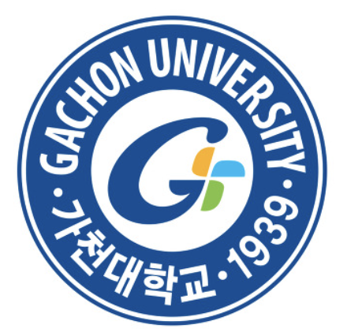
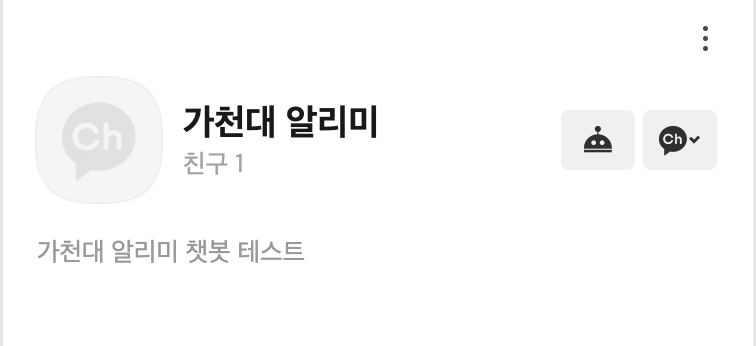

# gachon-chat-server

---

<br/><br/>



## 🗣 기능 소개

#### 🏫 가천대 알리미 

가천대 학생들을 위한 캠퍼스 정보를 제공하는 서비스입니다.

<br/><br/>

### 서버 flow


## 🛠 기술 스택
```
Language : Kotlin
Frameworks : Spring Boot
DB : MySQL
AWS : EC2, Code Deploy
CI/CD : Travis CI / AWS Code Deploy
Version control : GIT
Issue Tracker :
```
크롤링 서버 파이썬 OR 코틀린 사용할지 결정하기
